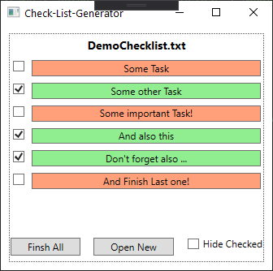

# Mini Checklist

Callable Checklist tool to not forget a certain thing

This mini tool doesn't aim to manage huge amounts of checklists or to write checklists in a fancy way.
It just reads a text file and displays each line as a button to be checked if the task is done



Finished tasks can also be hidden.


The pictures above are based on the following text file (which is also included to resources
``` text
Some Task
Some other Task
Some important Task!
And also this
Don't forget also ...
And Finish Last one!
```

# Calling with command-line argument

You can call this tool by passing target text-file which will be displayed directly after start
This also comes in handy if you would like to manage your checklists otherwise, like with the (Link-Manager)[https://github.com/Gustice/AHK-LinkManager]

# Technical Info
- Project is written in C# and targets .NET Core 3.0. This has no particular reason, the author just wanted to try it at least once
- Project utilizes the (Prism-Framework)[https://prismlibrary.com/docs/]. Again this has no particular reason. Honestly saying it seems a bit of unpractical in this case.
- This tool reads any text file and displays each line as a button. Currently there are no sophisticated checks or formatting routings implemented

# Todo

Several improvements are to be done (and could be added soon)
- Hints as a tooltip or details view to each task
- Special accentuation of important (or as important signed) tasks
- Perhaps some kind of hierarchical organization, like if some task in turn consist of several smaller tasks.