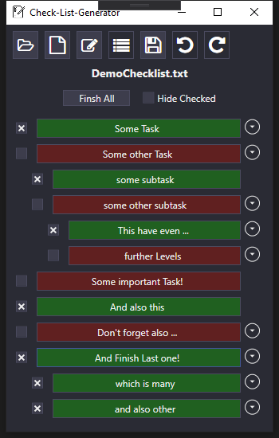
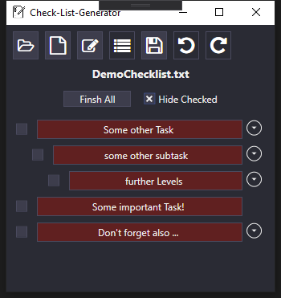

# Mini Checklist

Callable Checklist tool to not forget a certain thing

This mini tool doesn't aim to manage huge amounts of checklists or to write checklists in a fancy way.
It just reads a text file and displays each line as a button to be checked if the task is done



Finished tasks can also be hidden.



The pictures above are based on the following text file (which is also included to resources
``` bash
Some Task # Task Description for Some Task 
Some other Task # Task Description for Some other Task 
	some subtask # Task Description for some subtask 
	some other subtask # Task Description for some other subtask 
		This have even ... # Task Description for This have even ... 
		further Levels # Task Description for further Levels 
Some important Task! # Task Description for Some important Task! 
And also this # Task Description for And also this 
Dont forget also ... # Task Description for Don't forget also ... 
And Finish Last one! # Task Description for And Finish Last one! 
	which is many # Task Description for which is many 
	and also other # Task Description for and also other 
```

# Edit - View

Since version 0.3 this comes with an Edit view, that works on the same data basis as the checklist. Be careful since there are currently no undo or abort commands implemented


# Checklist - Syntax:

Each line defines a Task, Each task can have a comment and may be a child of a previous task.

## Tabulators

Each Tabulator defines a level in which the task is defines. 

- All Tasks on the same level are connected to the last Task from the level above. 
- All Tasks in the first Level (no tabulator) are connected to an implicit root
- Each task can have child tasks

If a parent task is checked all child tasks are implicitly checked too. 

## `#` Sign for Comment

The `#`-sign introduces the comment, or description for the task. The description is shown as tooltip and as description which can be expanded be clicking on the right expand button

# Calling with command-line argument

You can call this tool by passing target text-file which will be displayed directly after start
This also comes in handy if you would like to manage your checklists otherwise, like with the [Link-Manager](https://github.com/Gustice/AHK-LinkManager)

# Technical Info
- Project is written in C# and targets .NET Core 3.0. This has no particular reason, the author just wanted to try it at least once to not find any advantages in this case whatsoever.
- Project utilizes the [Prism-Framework](https://prismlibrary.com/docs/). Again this has no particular reason. Honestly saying it seems a bit of unpractical in this case, and seemed more to 

# Credits

- The awesome GUI-style is powered by [AdonisUI](https://github.com/benruehl/adonis-ui)

# Todo

Several improvements are to be done (and could be added soon)
- Special accentuation of important (or as important signed) tasks
- More convenient edit view, something with undo/redo commands abort command and shortcuts ...
  - Details Expand-Button should only be visible if there are any
  - Subtasks should be only visible on demand
- Save-File-Dialogue should start in the Folder the opened file is located
- Shortcut-Generator => Saves generated checklist with clickable link
- Well it comes late, but some unit tests would be great to harden the code for further improvements (sorry, no strict Test-Driven-Development here)
